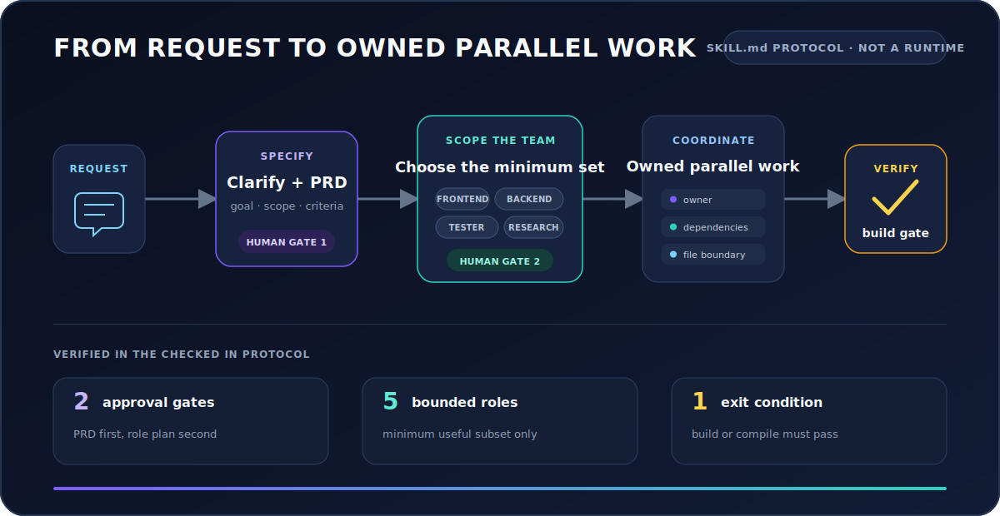

# Team Orchestrator

**A Claude Code skill that turns an open ended build request into a human approved plan, a deliberately scoped agent team, and owned parallel work.**

Team Orchestrator is a portable `SKILL.md` protocol, not a new agent runtime or framework. It encodes how a lead should clarify demand, choose the smallest useful team, divide ownership, coordinate specialists, and verify the result.

<p align="center">
  
</p>

| 2 approval gates | 5 bounded roles | 1 exit gate |
|:---:|:---:|:---:|
| PRD, then team composition | No invented roles during a run | Build or compile before delivery |

These are protocol rules in [`SKILL.md`](SKILL.md), not performance claims from a benchmark.

## What I designed

* **A specification gate:** the lead converts an ambiguous request into a PRD that stays at the *what* level, then waits for explicit approval.
* **A delegation policy:** the lead selects the minimum useful subset from a fixed role pool instead of spawning agents by default.
* **An ownership model:** tasks receive named owners, dependencies, and file boundaries before parallel execution begins.
* **Role specific quality controls:** the tester cannot weaken tests; the refactorer has scope limits, rollback rules, and a three failure circuit breaker.
* **A delivery gate:** the protocol blocks final delivery until a build or compilation check passes.

The interesting artifact is not “multiple agents.” It is the control system around them: when parallelism is justified, who owns what, where humans approve, and how the team knows it is finished.

## Execution protocol

The checked in skill currently describes this sequence:

```text
request
  │
  ├─ AskUserQuestion → clarify goal, scope, constraints, acceptance criteria
  │
  ├─ write PRD at the “what” level
  │       └─ HUMAN GATE 1: approve the PRD
  │
  ├─ select the minimum subset of five predefined roles
  │       └─ HUMAN GATE 2: approve the team
  │
  ├─ spawn selected specialists in parallel
  │
  ├─ TaskCreate → TaskUpdate(owner, dependencies, file boundaries)
  │
  ├─ TaskList + SendMessage → monitor, redirect, unblock
  │
  ├─ optional refactor pass after implementation and tests
  │
  └─ build / compile gate → synthesize → shut down teammates → report
```

### Verified proof points

1. **Parallelism is gated twice.** Steps 1 and 2 require explicit PRD and role plan approval before teammate creation.
2. **Delegation is constrained.** The role pool contains exactly five roles, and the protocol says to select only roles with concrete work.
3. **Completion has a hard condition.** Step 7 says not to proceed while the build or compilation check is failing.

## When to use it

Use this protocol when work has multiple independent tracks and coordination is part of the problem:

* A feature spans frontend, backend, and behavioral testing.
* Research, implementation, and verification can progress with clear boundaries.
* Teammates need to exchange findings or unblock one another.
* The cost of explicit planning is lower than the cost of conflicting work.

## When not to use it

Choose one Claude Code session, or a focused subagent, when:

* The change is small or strictly sequential.
* Most work touches the same file or depends on one unresolved decision.
* Coordination overhead and additional token use would exceed the parallelism benefit.
* You need a production scheduler, durable queue, retry engine, observability layer, or distributed runtime. This repository provides none of those.

## Status and limitations

**Status: design prototype and executable instruction artifact.** The repository contains one skill protocol, not runtime code, automated evaluations, recorded benchmarks, or a production deployment.

The current `SKILL.md` also targets an older Claude Code agent team tool surface:

* It names `TeamCreate` and `TeamDelete`. [Current Claude Code documentation](https://code.claude.com/docs/en/agent-teams) says those tools were removed in v2.1.178.
* It passes `team_name` to `Agent`; current documentation says that input is accepted but ignored.
* Agent teams remain experimental, are disabled by default, consume more tokens than a single session, and have documented limitations around resumption, task state, and shutdown.
* The role prompts reference external skills and tools that are not bundled or tested by this repository.

Treat the repository as evidence of orchestration design. Before relying on it for current production work, migrate the legacy team lifecycle calls, test the protocol against a current Claude Code release, and add repeatable evaluation scenarios.

## Role contracts

| Role | Owns | Encoded constraint |
|---|---|---|
| Frontend designer | Components, pages, styles | Prompt references external design critique and audit skills |
| Backend developer | APIs, services, data logic | Coordinates implementation failures with the tester |
| Researcher | Evidence and recommendations | Read only by default; challenges assumptions |
| Tester | Test files and verification | Cannot weaken tests or edit implementation to force a pass |
| Refactorer | Behavior preserving cleanup | Runs only after implementation; limited scope with rollback rules |

The protocol uses a fixed pool so the lead has to justify delegation instead of inventing a role for every task.

## Installation

Claude Code discovers personal skills from `~/.claude/skills/<skill-name>/SKILL.md`. The directory name determines the slash command, so this installation creates `/team-orchestrator`.

```bash
git clone --depth 1 https://github.com/Jacky040124/claude-team-orchestrator.git
mkdir -p ~/.claude/skills/team-orchestrator
cp claude-team-orchestrator/SKILL.md ~/.claude/skills/team-orchestrator/SKILL.md
```

For a project only installation:

```bash
mkdir -p .claude/skills/team-orchestrator
cp /path/to/claude-team-orchestrator/SKILL.md .claude/skills/team-orchestrator/SKILL.md
```

Agent teams are currently experimental. Follow the [official agent team setup](https://code.claude.com/docs/en/agent-teams) for the Claude Code version you are running. Skill paths and command naming are documented in the [official skills guide](https://code.claude.com/docs/en/skills).

## Invocation

Invoke the installed skill directly:

```text
/team-orchestrator Build a REST API and React dashboard
```

Or trigger it through the description in `SKILL.md`:

```text
Use the team-orchestrator skill. Spawn a team to build a markdown-to-PDF CLI.
```

The current protocol begins with requirement clarification. It should not create teammates until you approve both the PRD and the proposed role set.

## Referenced integrations

These projects are mentioned inside role prompts. They are not bundled dependencies, and fallback behavior is not fully specified by the current protocol.

| Integration | Referenced by | Project |
|---|---|---|
| Impeccable | Frontend designer | [pbakaus/impeccable](https://github.com/pbakaus/impeccable) |
| Ghost OS | Tester | [ghostwright/ghost-os](https://github.com/ghostwright/ghost-os) |
| OpenCLI | Researcher | [jackwener/OpenCLI](https://github.com/jackwener/OpenCLI) |

## Protocol map

The deep behavior lives in [`SKILL.md`](SKILL.md):

* **Role Pool:** five role prompts with responsibilities and boundaries.
* **Steps 1 and 2:** demand clarification, PRD construction, role selection, and approval.
* **Steps 3 through 6:** team lifecycle, parallel spawn, task ownership, and coordination.
* **Step 6.5:** optional behavior preserving refactoring after tests pass.
* **Step 7:** build verification, synthesis, teammate shutdown, and reporting.
* **Rules:** mandatory approvals, role constraints, and the delivery gate.

## Roadmap

* Migrate legacy team lifecycle instructions to the current Claude Code agent team interface.
* Add three repeatable evaluations: cross layer feature, parallel research, and same file rejection.
* Capture a real execution trace with task ownership and teammate messages.
* Define explicit fallback behavior for every referenced integration.

## Contributing

Contributions are welcome, especially current Claude Code compatibility updates, evaluation fixtures, and evidence from real orchestration runs. Please open an issue before a substantial protocol change.

## License

[MIT](LICENSE)
